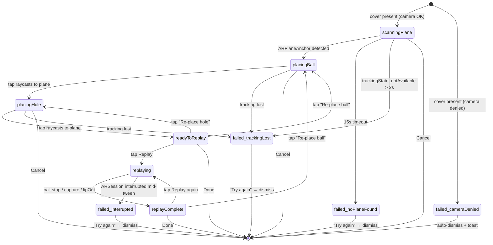

# AR Ball-Replay — Architecture (v1.1)

*Phase 2 design doc. Date: 2026-05-31. Targets a v1.1 follow-on to Build 14
(0.2.0, on TestFlight). Read with `research-synthesis.md` and
`codebase-audit.md` open in adjacent tabs.*

> **Spec compliance:** Spec §1 decision #6 (*"no AR ground plane in v1; 2D
> top-down result"*) stays green — the 2D top-down result is the default,
> untouched. AR replay is an **opt-in second view** layered behind a
> "Replay in AR" button on `ResultPhaseView`. Phone-only (#1) and no Apple
> Watch (#2) stay locked. Decision #6 is the one we evolve, additively.

---

## 1. User flow

```
1. Launch app                  →  existing PracticeSessionView (Build 14)
2. Walk .instructions →        →  UNCHANGED — Build 14 path
   .ready → .recording → .showing
3. .showing shows               →  distance, face chip, tempo, 2D roll,
   result panel                    PLUS new "Replay in AR" button
4. Tap "Replay in AR"           →  full-screen cover slides up
   (first ever time):              iOS prompts NSCameraUsageDescription;
                                   deny → cover dismisses + toast
5. Phase: AR SETUP              →  RealityView with live camera feed.
   (.scanningPlane)                Reticle searches. Top bar:
                                   "Point at the floor to set up your green."
                                   Cancel pill top-right.
6. Plane found                  →  reticle snaps to plane, subtle haptic,
   (→ .placingBall)                top bar: "Tap to place your ball."
7. User taps                    →  ball anchors at raycast hit point.
   (→ .placingHole)                Top bar: "Tap to place the hole."
8. User taps                    →  hole anchors. Top bar: "Lift the phone
   (→ .readyToReplay)              to watch the putt. Tap Replay."
9. Tap Replay                   →  ball tweens along simulated path.
   (→ .replaying)                  Outcome haptic at end.
                                   "Replay again" + "Re-place ball" buttons.
10. Tap Done                    →  cover dismisses; underlying .showing
                                   intact. User taps Build 14's existing
                                   Done button → tapDone() runs as today.
```

**Unchanged:** all 7 viewmodel phases; the 800 ms address-lock; the
`StrokeReplay` save Task; calibration-baseline accumulation; the 2D
top-down roll.

**New:** one button on `ResultPhaseView`, one full-screen cover, three
transient internal AR phases, one ARKit config-mode toggle.

The user can ignore AR replay entirely and the app behaves as Build 14.

---

## 2. File structure

All new files; nothing existing is modified. 12 files total:

| File | Purpose |
|---|---|
| `PuttingLab/Physics/BallPhysics.swift` | Pure ARKit-free 2D semi-implicit-Euler roll integrator. |
| `PuttingLab/Physics/BallPhysicsConstants.swift` | The `enum Constants` literal table (synthesis §5.3). |
| `PuttingLabTests/BallPhysicsTests.swift` | Swift Testing — 7 golden + edge cases. |
| `PuttingLab/Models/ARSceneState.swift` | `@Observable` cover state machine (anchors, phase, errors). |
| `PuttingLab/UI/ARSceneCoordinator.swift` | `@MainActor` RealityKit scene root, entities, raycast helper, replay driver. |
| `PuttingLab/UI/ARSetupView.swift` | View for `.scanningPlane` — coaching prompt + reticle. |
| `PuttingLab/UI/ARPlacementView.swift` | View for `.placingBall` / `.placingHole` — tap-to-place handler. |
| `PuttingLab/UI/ARReplayView.swift` | Top-level `RealityView` screen — hosts coordinator + HUD + Cancel/Done. |
| `PuttingLab/UI/ARReplayButton.swift` | The "Replay in AR" button. |
| `PuttingLab/UI/PracticeSessionView+ARReplayButton.swift` | Extension/modifier that overlays the button onto `ResultPhaseView` *without modifying `PracticeSessionView.swift`*. |
| `PuttingLab/Sensors/ARTrackingManager+PlaneDetection.swift` | Extension adding `setHorizontalPlaneDetectionEnabled(_:)` (config swap, no reset). |
| `PuttingLab/UI/PracticeSessionViewModel+ARReplayAccessors.swift` | Extension adding **read-only** `pendingArkitPoses` and `pendingResultForAR` accessors (audit §4.3 — the minimum surface needed). |

Every file lives under `PuttingLab/` or `PuttingLabTests/`. James adds them
to `project.yml`'s globbed dirs in follow-up (we don't touch project.yml).

---

## 3. State machine extension

The cover gets its own `ARSceneState` machine that runs **alongside** the
viewmodel's `Phase`. The parent stays in `.showing` for the cover's full
lifetime; the cover never advances the parent.

```swift
@MainActor @Observable
final class ARSceneState {
    enum Phase: Equatable {
        case scanningPlane, placingBall, placingHole
        case readyToReplay, replaying, replayComplete
        case failed(Reason)
    }
    enum Reason: Equatable {
        case cameraDenied, trackingLost, noPlaneFound, interrupted
    }
    var phase: Phase = .scanningPlane
    var ballAnchorWorld: SIMD3<Float>? = nil
    var holeAnchorWorld: SIMD3<Float>? = nil
    var targetLineWorld: SIMD3<Float>? = nil   // §4 of this doc
    var simulationResult: BallPhysics.Result? = nil
}
```



The viewmodel's `Phase` enum is **unchanged**. While the cover is up,
`viewModel.phase == .showing`. The cover dismisses; user taps the
existing Done button; `tapDone()` runs as in Build 14.

**Why separate from `PracticeSessionViewModel`:** audit §4.2 / §5.2 — the
viewmodel's double-start guard, recording `defer`, and calibration
accumulation in `tapDone()` are load-bearing. Lifecycle isolation, crash
blast-radius containment, test surface, and the `LiveImpactDetector`
`@MainActor` contract all argue against piling new state in.

**Data crossing the boundary** — read-only, from viewmodel into cover:
`pendingResult`, `pendingArkitPoses` (new accessor), and
`profile.speedToDistanceFactor`. Nothing flows back. The cover is
presentation-only.

---

## 4. Public API surface for `BallPhysics.swift`

Pure, side-effect-free, no ARKit import. Sits next to `DistanceModel.swift`.

```swift
public enum BallPhysics {
    public struct PathSample: Sendable, Equatable {
        public let position: SIMD2<Float>   // metres in green frame
        public let velocity: SIMD2<Float>   // m/s
        public let time: Float              // s since launch
    }
    public enum Outcome: Sendable, Equatable {
        case captured, lipOut, stopped
    }
    public struct Result: Sendable, Equatable {
        public let path: [PathSample]
        public let outcome: Outcome
        public let endPosition: SIMD2<Float>
        public let endVelocity: SIMD2<Float>
        public let totalDuration: Float
    }

    public static func simulatePutt(
        peakVelocity: Double,            // m/s, from ImpactResult.peakVelocity (>= 0)
        faceAngleRaw: Double,            // radians, signed, from ImpactResult.faceAngleRaw
        speedCalibration: Double,        // dimensionless, profile.speedToDistanceFactor
        stimpFeet: Double = Constants.defaultStimp,   // clamped [4, 14]
        startPosition: SIMD2<Float> = .zero,
        cupPosition: SIMD2<Float>
    ) -> Result
}
```

`Constants` (drop into `BallPhysicsConstants.swift`, identical to synthesis
§5.3 with namespace `BallPhysics.Constants`): `g 9.81`, `rollInertiaFactor
5/7`, `stimpExitVelocity 1.91`, `defaultStimp 10`, `cupRadius 0.054`,
`captureVelocity 1.626`, `launchCoefficient 0.90`, `skidEnergyRetention
0.95`, `dtSim 0.001`, `dtSampleOut 0.01`, `stopVelocity 0.05`,
`lipOutVelocityRatio 0.6`, plus `rollingFriction(stimpFeet:)` = `0.611 / s`.

### Justifications

| Choice | Why |
|---|---|
| `SIMD2<Float>` positions | Synthesis §1.1 — 2D green frame is sufficient (no slope in v1.1). Float matches RealityKit entity transforms — saves a cast per frame; sub-mm precision over 9 m is well inside Float epsilon. |
| `peakVelocity: Double` | Matches `ImpactResult.peakVelocity` (audit §2.1). Promoted to Float internally; no silent type narrowing at the boundary. |
| `faceAngleRaw: Double`, no sign-flip at call site | Synthesis §3.3: callers pass `ImpactResult.faceAngleRaw` raw; `BallPhysics` applies `ψ_0 = -faceAngleRaw` internally. Keeps the call site oblivious to green-frame convention. |
| `speedCalibration: Double`, no default | Synthesis §8 — "Always use the calibration factor in the AR pipeline." Forcing the caller to pass it prevents the silent-1.0 bug. UI surfaces a "Calibrate first" tooltip when the value is 1.0. |
| `stimpFeet` defaulted to 10, clamped [4,14] | Synthesis §2.1 default; §1.2 sanity. Hidden from user in v1.1 per §2.1 UX recommendation. Clamp protects against div-by-tiny when v1.2 adds a dev slider. |
| `cupPosition` required, no default | Caller must place a hole. Mandatory at the API forces UX through `.placingHole`. |
| `startPosition` defaulted `.zero` | Natural origin of green frame = ball anchor. Common case. |
| Single `simulatePutt` entry point | Synthesis §5.1. Internal Euler loop private — v1.2 can swap in slope-aware integration without changing public surface. |
| `Result.path` sampled at 10 ms | Synthesis §5.1 step 8. ~300 samples per 3-second roll — small enough to ship in the `@Observable`. |
| `Outcome` 3-case (no `.offGreen`) | Synthesis §1.7 capture + lip-out + stop. Room floor treated as infinite green for v1.1; UI lets the ball run into room boundaries naturally. |
| `Sendable` + `Equatable` | Future-proofs for off-MainActor integration; makes tests cleaner. |
| `public static func` | Stateless — no model to hold between strokes. `BallPhysics.simulatePutt(...)` reads cleanly at call site. |

---

## 5. AR session lifecycle

**One ARSession only.** `ARTrackingManager` (Build 14) owns it. AR replay
does NOT spin a second — iOS only allows one tracking config per app at a
time, and a fresh session would discard the world coordinates the impact
analysis used.

**Session start: app launch (unchanged).** `ARTrackingManager.start()`
called by `PracticeSessionView` `.active` scene-phase. Config:
`planeDetection = []`, `frameSemantics = []`, `environmentTexturing
= .none`, `isLightEstimationEnabled = false` — headless yaw + transform
source only. Stays running across `.instructions`, `.ready`, `.recording`,
`.showing`.

**Session config change: cover present.** User taps "Replay in AR" →
`ARReplayView.onAppear` → coordinator calls
`arTracking.setHorizontalPlaneDetectionEnabled(true)`. Inside:

```swift
config.planeDetection = [.horizontal]
config.isLightEstimationEnabled = true   // on — PBR ball entity
session.run(config, options: [])         // NO reset — preserves world frame
```

`options: []` is load-bearing. `[.resetTracking]` here would make the
world-space target line we resolved from `pendingArkitPoses` meaningless.
Audit §4.4 confirmed ARKit supports this config swap without reset.

**Session config change: cover dismiss.** `ARReplayView.onDisappear` →
`setHorizontalPlaneDetectionEnabled(false)` → re-run with
`planeDetection = []`, `isLightEstimationEnabled = false`, `options: []`.
User returns to `.showing` exactly as Build 14.

**Across multiple strokes in the same practice session.** Yes — the
ARSession stays alive across every stroke, exactly as Build 14. Per
stroke: `.ready` (headless) → `.recording` → `.showing` → (optional)
cover up (planes on) → cover dismiss (planes off) → `tapDone()` → next
stroke `.ready`. Anchors from a previous AR replay are **not** re-used —
they belong to the previous stroke's room scan, and the user may have
moved. Re-use is v1.2.

**Reading-pose → stroke-pose → AR-pose transition.** During the stroke
(`.recording`) the camera may or may not see the floor — irrelevant,
because AR replay isn't running. Headless ARKit just integrates VIO from
whatever it sees. When the cover is presented, `.scanningPlane` is the
first phase precisely because we cannot assume the phone is already
pointed at the floor — explicit guidance ("Point at the floor"). During
`.replaying`, the prompt at end-of-placement ("Lift the phone to watch
the putt") tells the user to step back and view from above.

**Tracking loss / interruption.** `ARTrackingManager` handles
`sessionWasInterrupted` / `sessionInterruptionEnded` (audit §1.1, §6.6) —
but `sessionInterruptionEnded` does a full reset-tracking, which makes
prior anchors stale. The coordinator subscribes to `trackingState`; on
`.notAvailable` it pushes `.failed(.trackingLost)`. UI shows "Tracking
lost — Try again" and dismisses on tap. We do not pretend stale anchors
are valid.

**Underlying `.showing` scene-phase race (audit §6.4).** A
`.fullScreenCover` does not change the underlying view's scene phase to
`.background` (only true backgrounding fires `.background`). Tested
assumption — if a future iOS changes this, the coordinator gates session
changes on its own flag, not on scene-phase callbacks.

---

## 6. What we punt on for v1.1

Listed explicitly so reviewers can confirm — each is a synthesis-deferred item, nothing is a surprise cut:

- **Green slope** — flat-green only. v1.2 reads `ARPlaneAnchor.transform.up` → §1.6 vector EoM. (Synthesis §1.6, §4.2)
- **Ball spin / launch loft** — phone can't measure putter loft; backspin dies in ~30 cm. (§4.1)
- **Multiple ball positions per hole** — one ball, one hole per replay. (§4.2)
- **Replay scrubbing** — play once; Replay button restarts t=0. v1.2 adds timeline + freeze-at-impact.
- **Lip-out phase-plane** — linear `b_crit` interpolation; Hogan & Antali full separatrix is v1.2. (§1.7)
- **Grain (Bermuda)** — qualitative only in literature; deferred. (§2.2, §4.4)
- **Wind** — indoor-only AR. (§4.6)
- **Path-vs-face split (Pelz 83/17)** — not phone-derivable. (§1.5, §4.7)
- **Per-user `k_launch` calibration** — 3-putt cal already absorbs into `speedToDistanceFactor`. (§4.8)
- **Re-using anchors across strokes** — discarded on cover dismiss; v1.2.
- **`StrokeReplay` schema v2 with ARKit poses serialized** — audit §6.1; deferred so AR replay is in-session only.
- **Slope-corrected capture velocity** — hard 1.63 m/s; v1.2 subtracts slope projection.
- **Left-handed user toggle** — RH-only; sign convention marked `// HACK:` per synthesis §3.3.
- **Variable friction (PING/Burritt)** — single μ_r per replay.
- **Bounce / aerial drop** — pure-roll only. (§2.5)
- **Off-green polygon** — room floor = infinite green; v1.2 adds optional fringe outline.

---

## 7. Build order

In strict order — each step prerequisite for the next:

1. **`BallPhysicsConstants.swift`** — 15 min, literals. Simulator.
2. **`BallPhysics.swift`** — 2-3 h, synthesis §5.1 steps 1-8. Simulator. **Load-bearing.**
3. **`BallPhysicsTests.swift`** — 2 h. Seven cases:
   1. *Distance match*: Stimp 10, peakVel 0.3, face 0, speedCal 5 → end-distance within ±10 % of `DistanceModel.compute(peakSpeedMps: 0.3)` at Stimp 10.
   2. *Sign convention*: face +0.1 rad (OPEN, RH push right) → `endPosition.y < 0` in green frame; face −0.1 → `endPosition.y > 0`. Catches the audit §2.2 regression.
   3. *Stimp ratio*: Stimp 14 vs Stimp 6, same input → distance ratio ≈ 14/6 ≈ 2.3 (linear in S per §1.1).
   4. *Capture / lip-out boundary*: cup at 3 m, peakVel tuned so v_entry just < 1.63 → `.captured`; tune up → `.lipOut`.
   5. *Zero peakVelocity* → no movement, `.stopped`. Defends div-by-zero in friction term.
   6. *`speedCalibration == 1.0`* → under-rolls but path non-empty.
   7. *Stimp 0 / Stimp 1000* → clamp engages; no crash.
   Simulator.
4. **`ARSceneState.swift`** — 1 h, pure `@Observable`. Phase-transition unit tests. Simulator.
5. **`ARTrackingManager+PlaneDetection.swift`** — 1 h, extension. **Real device required** to verify config-change-without-reset; simulator's ARKit is non-functional for planes.
6. **`ARSceneCoordinator.swift`** — 4-6 h. RealityKit scene root, entities, raycast, replay driver. **Real device** from here on. (Simulator-stub the raycast for SwiftUI rough-out only.)
7. **`ARSetupView` / `ARPlacementView` / `ARReplayView`** — 4-6 h. Use `RealityView` (iOS 18+) with fall-back to `ARViewContainer` UIViewRepresentable for iOS 17. **Real device.**
8. **`ARReplayButton.swift` + `PracticeSessionView+ARReplayButton.swift`** — 1 h. The button + a `ViewModifier` that overlays it onto `ResultPhaseView` *without modifying the source file*. Simulator OK.
9. **`PracticeSessionViewModel+ARReplayAccessors.swift`** — 30 min. Two read-only computed properties. Swift Testing asserts read-only-ness and that they return nil/empty when `phase != .showing`. Simulator.
10. **End-to-end TestFlight build** — **Real device.** Walk through §1 user flow. Bring James a phone.

**Simulator vs real device:** steps 1-4, 8, 9 are simulator-OK; steps 5-7
and 10 need a real iPhone. The physics ships testable before any AR work
— that's the whole point of building it first.

---

## 8. Open questions for James

Bundle into one review pass before §7 step 6 begins:

1. **Sign convention re-confirmation.** Synthesis §3.3 + audit §2.2:
   negative `faceAngleRaw` = closed face = pull left for RH user. We
   invert inside `BallPhysics` to produce `ψ_0 = -faceAngleRaw` in the
   green frame (`+y = left`). Confirm a deliberately-closed-face test
   stroke should animate **left** of the target line.
2. **Default Stimp.** v1.1 ships hidden at Stimp 10. Tooltip after first
   AR replay ("These greens are running 10")? Or slider immediately?
   Synthesis §2.1 votes "hidden in v1, surface in v1.1+".
3. **Ball appearance.** Photoreal white USDZ, or stylised Mario-Kart-
   flavoured ball (matches locked decision #4)? Stylised is cheaper to
   ship and on-brand.
4. **Hole appearance.** Flag + cup disc, or just cup disc with glowing
   rim? Spec §3 Phase 1 shows "ball + flag" for 2D — should AR echo?
5. **Speed-calibration tooltip text + behaviour.** When entering AR with
   `speedToDistanceFactor == 1.0`, ball rolls a few cm. Synthesis §3.1 +
   §8 recommend "Calibrate to get realistic rolls" tooltip. Block
   replay (modal sheet) or overlay (replay still runs)?
6. **Capture haptic + sound.** Plan `.success` notification haptic + a
   bundled `.caf` "ball-in-cup". Need an asset. Spec §3 Phase 6 mentions
   "celebration animation" on a make.
7. **Plane-not-found timeout.** 15 s in `.scanningPlane` →
   `.failed(.noPlaneFound)`. Too long? Too short? UX call.
8. **AR replay button visibility on `.showing`.** Always shown, or
   behind a small icon? Audit §5.3 — `DragGesture` minimumDistance 0
   means a stray tap could re-fire `touchDown` if dismissal animations
   briefly expose `.ready`. Recommended: full-width button with 200 ms
   `.scaleEffect` press feedback so it's clearly a deliberate tap.
9. **Anchor placement: tap vs drag.** v1.1 plan = single tap (cheaper,
   Mario-Kart-style "good enough"). Confirm before build.
10. **Default ball reticle position.** Recommended UX: reticle floats
    ~1.5 m in front of phone on detected plane until user moves/taps.
11. **`StrokeReplay` schema bump now or later?** Audit §6.1 + §6 above:
    deferred to v1.2 means AR replay is **in-session only** (can't
    re-play a saved stroke from the gallery in AR). Confirm OK to defer.
12. **Left-handed user handling.** v1.1 assumes RH. Has anyone in the
    TestFlight cohort flagged this?
13. **Cover dismiss UX on success.** On `.captured`, manual Done or
    auto-dismiss after 2 s? Spec §3 Phase 6 auto-advances the 2D view
    after 3 s. Recommend manual to give the user a beat.
14. **Lip-out haptic.** Add a `UISelectionFeedbackGenerator` tick at the
    lip-out moment for the near-miss feel? AR analogue of spec §3
    Phase 6's "subtle .selection tick on clear miss". Recommend yes.

---

*Next step: James triages §8 open questions. Engineer then follows §7's
build order. Steps 1-3 (constants + integrator + tests) are unblocked
today and can land in `PuttingLab/Physics/` even before any AR UI work
begins — pure logic, no risk to Build 14.*
